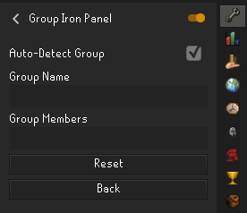

# Group Iron Panel

Group Iron Panel is a [RuneLite](https://runelite.net/) plugin that adds a new panel for viewing your Group Ironman group's skills and hiscores all in the same place.

## How to Use

You need to enter your group's name and the group members' usernames in the plugin config. The member names must be comma-separated (e.g. Player1,Player2,Player3).

If Auto-Detect Group is selected, the plugin will automatically detect your group name and members when the in-game Group Ironman tab is open. You will not need to manually enter the group information if you use this option.

Once configured, the plugin adds a new panel in the RuneLite sidebar which displays the hiscores for the group members. The arrow button next to the group name can be used to refresh the hiscores at any time.

